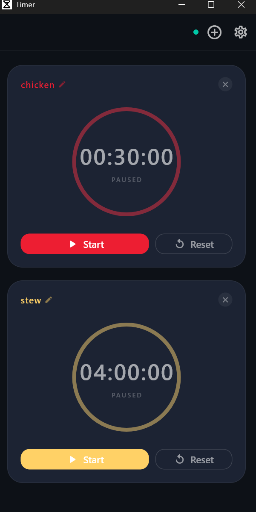
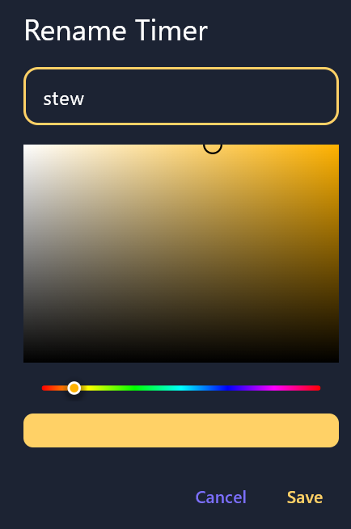
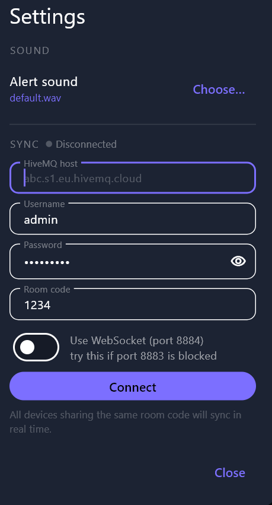
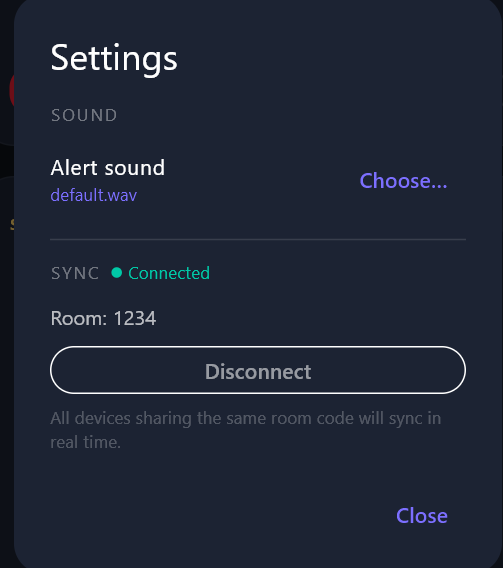

# Work Timer

A multi-device countdown timer app for **Android** and **Windows** with real-time sync via HiveMQ Cloud.

---

## Features

- Multiple simultaneous countdown timers with custom names and colors
- Alert sound (looping) when a timer elapses, with haptic feedback on Android
- Real-time sync across devices using MQTT — everyone on the same room code sees the same state
- Custom alert sounds (WAV, MP3, OGG, AAC, M4A)

---

## Screenshots

| Main interface | Timer settings | Sync — connect | Sync — connected |
|:-:|:-:|:-:|:-:|
|  |  |  |  |

---

## Using the App

### Adding and Managing Timers

Tap **+** in the top bar to add a timer. Each timer card shows:

- **Name** — tap the name to rename it and pick a color
- **Ring** — visual progress of the countdown
- **Time display** — remaining time in `HH:MM:SS`; shows `--:--:--` until a duration is set
- **Status badge** — shows the end clock time while running, `PAUSED`, `ELAPSED`, or `TAP TO SET`

Tap the **×** button on a card to remove it (requires at least one timer to remain).

### Setting a Duration

Tap the time ring (or the **Set Time** button) to open the duration picker. Enter hours, minutes, and seconds. You can also scroll or drag each field to adjust the value. Tap **Save**.

### Starting, Pausing, and Resetting

| Button | Action |
|--------|--------|
| **Set Time** | Opens duration picker (only shown when no duration is set) |
| **Start** | Begins the countdown |
| **Pause** | Pauses at current remaining time |
| **Reset** | Restores the timer to its full duration |

When a timer reaches zero it stops automatically, plays the alert sound, and the card turns amber. Tap the **stop sound** button (speaker icon in the top bar) to silence it. Start the timer again to count down once more.

### Customizing a Timer

Tap the timer name to open the rename dialog. You can:

- Type a new name
- Pick a color using the HSV palette — drag the square for saturation/brightness, drag the hue bar for hue

### Changing the Alert Sound

Open **Settings** (gear icon) → **Sound** → **Choose** and select any supported audio file. Tap the reset icon to restore the default sound.

---

## Syncing Across Devices (HiveMQ Cloud)

All devices sharing the same **room code** stay in sync in real time — starting, pausing, or resetting a timer on one device is reflected immediately on all others.

### Setting Up a HiveMQ Cloud Cluster

1. Create a free account at [hivemq.com/mqtt-cloud-broker](https://www.hivemq.com/mqtt-cloud-broker/)
2. Create a new **Serverless** cluster
3. Under **Access Management**, create a credential (username + password) with publish and subscribe permissions
4. Note your cluster hostname — it looks like `abc123.s1.eu.hivemq.cloud`

### Connecting the App

Open **Settings** → **Sync** and fill in:

| Field | Description |
|-------|-------------|
| **Host** | HiveMQ cluster hostname, e.g. `abc123.s1.eu.hivemq.cloud` |
| **Username** | Credential username from Access Management |
| **Password** | Credential password |
| **Room code** | Any shared string — all devices with the same code sync together |
| **WebSocket** | Enable if port 8883 is blocked on your network (falls back to port 8884 over WebSocket) |

Tap **Connect**. The status dot in the top bar turns green when connected. The tooltip shows the active room code.

Enter the same credentials and room code on every device you want to sync. Different room codes are completely isolated from each other.

### Disconnecting

Open **Settings** → **Sync** → **Disconnect**. The app continues working locally with no sync.
